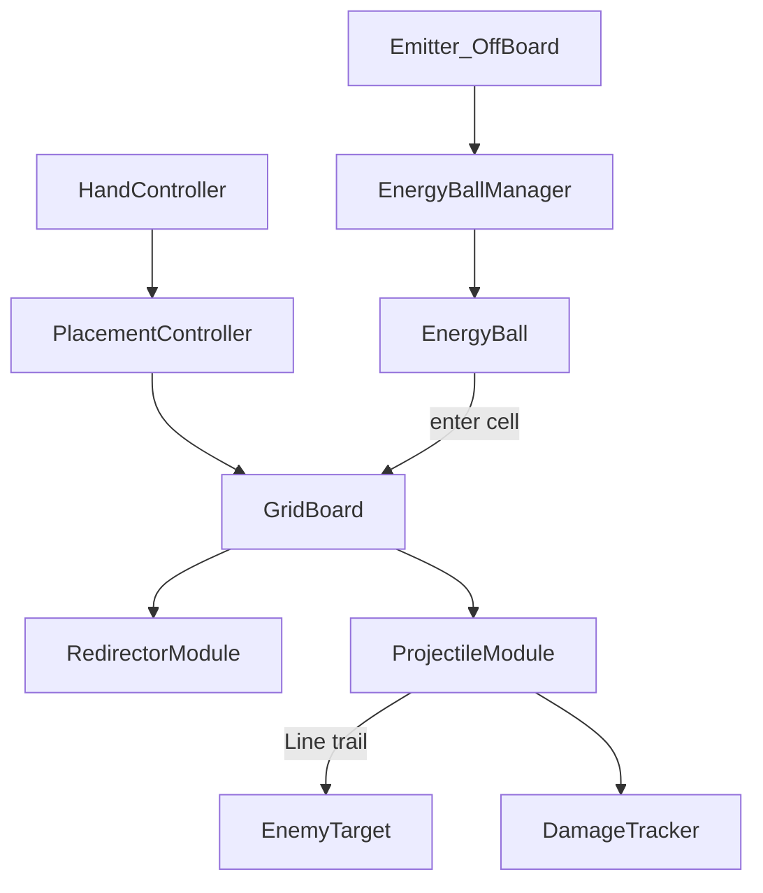

# GMTK2026 塔防 V0 Prototype 计划

## 目标

做出一个能演示核心循环的最小原型：

**手牌选模块 → 摆到 7×7 → 棋盘外发射器持续发球 → 收束器拐弯 → 射弹塔吸能开火 → 打静止靶子 → 看累计伤害**

不追求数值深度、无限构筑、商店经济；只证明画面结构与玩法骨架成立。

## 对你要点的取舍

### 保留（按你说的做）

- 上战斗 / 下棋盘+商店预留 / 底手牌的画面结构
- 棋盘右侧商店占位（约能放 5–6 个商品槽视觉，不接逻辑）
- 战斗区右上角静止敌人靶子
- 底部手牌区约 5 格
- 光球：能量固定 1、有飞行速度与寿命、小圆圈显示
- 全场光球数量上限
- 发射器向右、每 2 秒发一颗（位置见下方修订）
- 射弹模块：储能上限 10；有能量时每 0.1s 消耗 1 点打最近（最左）敌人，伤害 5；拖尾线特效
- 可旋转的 90° 改向模块、可摆放、可打靶、记录伤害

### 相对原草案的修订（本次确认）

1. **发射器在棋盘外**：不占据任何格子。固定放在格子 `(0,3)` **左侧外侧**，向右把球射入 `(0,3)`。`(0,3)` 是普通可放置格。
2. **不做“伪镜子”**：取消“无论从哪边进入都朝固定方向飞出”的简化。模块正式命名为 **收束器（`RedirectorModule`）**——可旋转的 90° 弯道：某一朝向下例如 **左进 → 上出**（双向连通该直角的两条口）。
3. **代码可读性**：类、公开方法、关键私有逻辑都写准确中文/英文注释；方向表、触发生命周期写清楚，方便队友直接读代码。

### 原型必须补上（没有会跑不起来）

- **格子命中规则**：光球飞到格子中心附近时触发该格模块一次（同球同格不连触），再按新方向继续飞
- **出界销毁**：飞出 7×7 边界立刻销毁（寿命到也销毁）
- **手牌初始内容**：开局手牌预填若干收束器 + 射弹（商店不做，否则没东西可摆）
- **摆放交互**：点选手牌 → 点空格放置；收束器支持旋转（`R` 键或右键，放置前预览朝向）
- **伤害 HUD**：显示 `Total Damage`（靶子可设很大血量或只记伤害）

### 明确砍掉（本原型不做）

- 金币、商店购买、波次、敌人移动、魔法师血量、胜负
- 球质量/颜色/类型、分流、中继、射速增幅
- 拆除返还、拖拽精细 UX、存档、教程

## 画面布局（竖屏逻辑分区）

```text
┌──────────────────────────────────────┐
│ 战斗区 ~20%                           │
│  [Damage HUD]          [Enemy Target]│
├───┬───────────────────────┬──────────┤
│ E │ 7×7 棋盘              │ 商店预留 │
│ → │ (0,3) 可放置          │ 5~6 槽位 │
│   │                       │ (无逻辑) │
├───┴───────────────────────┴──────────┤
│ 手牌区 ~5 槽：Redirector / Projectile │
└──────────────────────────────────────┘
  E = Emitter（棋盘外，对准 row=3 向右射入 col=0）
```

实现方式：单场景 + Orthographic Camera；世界坐标分区摆 Sprite；伤害与手牌用 **uGUI Overlay**。

锁定比例（代码常量，可调）：

- 战斗区高度约占屏幕 20%
- 棋盘+商店约占 65%
- 手牌约占 15%
- 棋盘：商店宽度约 `3:1`

## 核心数据与规则（冻结）

| 项 | 值 |
|----|----|
| 棋盘 | 7×7，`col 0..6`, `row 0..6`；约定 **`(0,0)` = 左下**，row 向上增大 |
| 发射器 | **棋盘外**，世界坐标在 cell `(0,3)` 中心左侧约 `0.6~1.0` 格处；方向 Right；间隔 `2.0s`；不占格、不可被盖 |
| 光球能量 | 恒定 `1` |
| 光球速度 | 默认 `4` 格/秒（Inspector 可调） |
| 光球寿命 | 默认 `5s` + 出界销毁双保险 |
| 全场球上限 | 默认 `40`；达上限时本发跳过 |
| 收束器 | 4 朝向的 90° 弯道（见下表）；放置时可旋转预览 |
| 射弹塔 | `energy` 0..10；球命中 `+1`（封顶）；有能量时每 `0.1s`：`energy-1`，对最左敌人 `5` 伤 |
| 靶子 | 静止；累计受伤 |

### 收束器（Redirector）转向约定

命名不用“镜子”，避免与真实反射光学混淆。语义是 **直角管道 / 收束改向**：

- 每个收束器有 `orientation`：`0..3`（放置时 `R` 旋转）
- 每个朝向连通 **两个相邻方向**（一条直角边）。从任一连通口进入，从另一口出去。
- 从非连通方向进入：**不改向**（球按原方向穿过该格，仍算触发过一次，避免同格连触刷能量——若该格只有收束器则只是路过）

四朝向映射表（写进 `RedirectorModule` 注释与常量）：

| orientation | 连通口 | 效果示例 |
|-------------|--------|----------|
| 0 | Left ↔ Up | 左进上出；上进左出 |
| 1 | Up ↔ Right | 上进右出；右进上出 |
| 2 | Right ↔ Down | 右进下出；下进右出 |
| 3 | Down ↔ Left | 下进左出；左进下出 |

视觉：用 L 形或缺角方块表示朝向，旋转时同步更新。

## 系统架构



### 脚本清单（`Assets/Scripts/`，按职责拆分）

每个公开类型、公开方法、关键状态机步骤写注释（类头说明职责；方法说明入参/副作用；方向表旁注释映射含义）。

- `Core/GridDirection.cs` — 四向枚举 + 向量换算 + 旋转辅助
- `Core/GridCoord.cs` — `(col,row)` 结构
- `Board/GridBoard.cs` — 7×7 占格、世界坐标 ↔ 格子、查询/放置模块
- `Ball/EnergyBall.cs` — 移动、寿命、进格检测、能量=1
- `Ball/EnergyBallManager.cs` — 生成、上限、回收/销毁
- `Board/Emitter.cs` — 棋盘外定时向右发球，目标射入 `(0,3)`
- `Modules/ModuleBase.cs` — `OnBallEnter(EnergyBall ball)` 抽象基类
- `Modules/RedirectorModule.cs` — 收束器 90° 弯道逻辑 + 朝向可视化
- `Modules/ProjectileModule.cs` — 吸能、0.1s 开火、LineRenderer 拖尾
- `Combat/EnemyTarget.cs` — 静止靶、受击
- `Combat/DamageTracker.cs` — 累计伤害 + UI 文本
- `UI/HandController.cs` / `HandSlot.cs` — 5 槽手牌、选中
- `UI/PlacementController.cs` — 选中→点格放置、收束器旋转预览
- `UI/ShopPanelPlaceholder.cs` — 右侧空槽，无逻辑
- `Game/GameBootstrap.cs` — 组装布局、刷手牌、放发射器与靶子

视觉：彩色方块/圆 Sprite（白图着色），不做像素美术。

## 代码规范（本原型强制）

- 类头注释：这个类干什么、不干什么、和谁协作
- 公开 API：参数含义、何时调用、改了什么状态
- 收束器方向表、发射器“棋盘外”坐标计算必须有注释
- 避免无意义注释（不写 `// 增加 i`）；优先解释规则与约定
- 命名用完整单词：`RedirectorModule`、`TryRedirect`、`ConsumeEnergyAndFire`

## 场景与工程落地步骤

1. **工作区**：执行阶段先 `move_agent_to_root` 到 `D:\unity\GMTK2026塔防V0`，再改文件。
2. **目录**：`Assets/Scripts/`（按上面子文件夹）、`Assets/Prefabs/`、场景用 `SampleScene` 或新建 `Prototype.unity`。
3. **搭场景分区**：Camera、Canvas（Damage + Hand + ShopPlaceholder）、BoardRoot、BattleRoot、Emitter 放在 board 左侧外侧。
4. **实现 Grid + 坐标换算**，画出 7×7；确认 `(0,0)` 左下。
5. **实现光球 + 棋盘外发射器**，球从左侧飞入 `(0,3)`，出界/寿命销毁，上限生效。
6. **实现收束器 + 旋转放置**，按映射表验证左进上出等四朝向。
7. **实现射弹塔 + 靶子 + 伤害数字**。
8. **串手牌**：开局例如 `Redirector×3 + Projectile×2`，能摆出“外置发射器 → 收束器拐弯 → 射弹塔”最小路径。
9. **Play Mode 验收**。

## 验收标准（Prototype Done）

1. Play 后可见：上靶子、中棋盘+右侧商店空位、底手牌；发射器在棋盘左侧外侧，不占格。
2. 每 2 秒向右发球进入 `(0,3)`；球数不超过上限；`(0,3)` 可放置模块。
3. 能放置并旋转收束器；按朝向表正确 90° 改向（如左进上出），而不是“强制朝某一 facing 飞出”。
4. 射弹塔吸能后按 0.1s 节奏向靶子拉线并造成伤害；HUD 累计伤害增加。
5. 脚本结构清晰，关键规则有注释，队友可直接阅读。

## 实现时注意（防返工）

- **发射器与格子解耦**：Emitter 只持有“入口格子 `(0,3)` + 外侧偏移”，绝不写入 `GridBoard` 占用表。
- **棋盘逻辑与战斗坐标分离**：LineRenderer 用世界坐标连炮塔与 `EnemyTarget`。
- **进格只触发一次**：用“当前格 != 上一格”边沿检测，防止同一颗球灌爆射弹塔能量。
