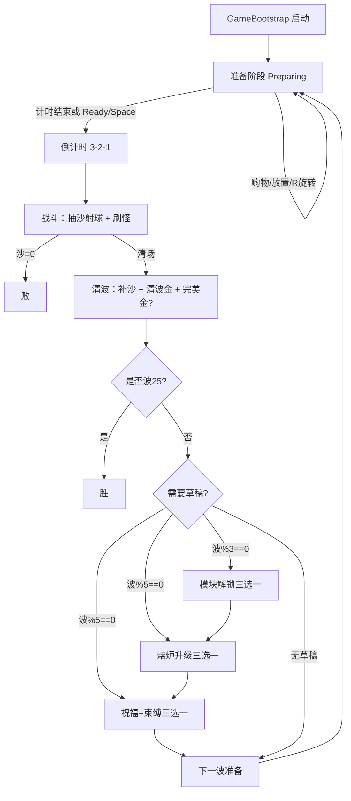

# 01 — 游戏总览

## 1. 游戏简介

**品类**：Roguelike 元素的 **电路式塔防**（Energy Path Tower Defense）。  
**一局结构**：准备 → 倒计时 → 刷怪战斗 → 清波奖励 →（可选）三选一草稿 → 下一波；共 **25 波**。  
**失败条件**：沙漏时间耗尽。  
**胜利条件**：第 25 波（含巨型 Boss）清完且沙漏仍有剩余。

玩家在左侧 **7×7 棋盘**上放置「路径模块」与「攻击/辅助模块」，右侧从商店买牌入手牌再放到棋盘。战斗开始后，**熔炉**不断消耗沙漏时间射出 **能量球**；球沿路径进入各塔的储能，塔再向右侧战斗道上的敌人开火。

## 2. 风格与呈现

| 维度 | 现状 |
|------|------|
| 视觉 | 原型风：程序化方块/圆（`PrototypeSprites`），可接 `GameSkin` Sprite |
| 语言 | UI/文案以中文为主（模块名、草稿、提示） |
| 音频 | `UIAudioFeedback` 占位，非重点 |
| 镜头 | 正交相机，Bootstrap 按棋盘窗 + 战斗道拟合 |

主题气质：**工厂 / 能量 / 沙漏时间**（查理激光、大卫炸弹、比特币矿机、核聚变等命名偏玩梗）。

## 3. 运行形式（技术）

```
Unity Play
  → GameBootstrap.RuntimeInitialize / Awake
  → BuildPrototype()
      创建 WorldRoot（棋盘、熔炉、球管理、战斗道、敌人根）
      创建 Canvas UI（手牌、商店、沙漏面板、草稿、HUD…）
      接线 Economy / RunModulePool / Directors / WaveManager
  → WaveManager.Initialize → BeginPrepForWave(0)
```

- **几乎无场景依赖**：SampleScene 可为空壳；逻辑全在代码。
- **不暂停时间**：准备阶段靠 `GameSession.IsPreparing` 禁熔炉抽沙，不是 `timeScale=0`。
- **2D XY**：棋盘 (0,0)=左下；战斗道在棋盘上方偏右；敌人从右向左走向 Mage/沙漏列。

## 4. 重点设计（设计支柱）

1. **时间即生命**：抽沙出球 = 主动燃烧生命换输出；漏怪再罚一大截。
2. **球是能量货币**：塔不「自动产蓝」，必须球投喂。
3. **路径是构筑核心**：收束器拐弯、环路让球多次经过塔；后期还有传送门/分裂/聚变裂变。
4. **强度台阶**：每 3 波解锁模块；每 5 波熔炉升级 + 祝福/束缚（有得有失）。
5. **经济与威胁挂钩**：波金币预算指数涨；商店价按 stage×稀有度涨。

## 5. 前端结构（玩家看到的分区）

```
┌─────────────────────────────────────────────────────────────┐
│  战斗道（敌人从右→左）          剩余波数 HUD                  │
│  [沙漏UI叠在 Mage 位]                                        │
├──────────────────────┬──────────────────────────────────────┤
│  棋盘窗（约左半）      │  侧栏「模块仓」                        │
│  · 7×7 / 可扩展 3→5→7 │  · 上手牌 8 槽                        │
│  · 熔炉在左入口 (0,3) │  · 下商店 6 槽 + 刷新                  │
│  · 球数 HUD 在棋盘上  │                                      │
│  · 右上分解区         │                                      │
│  · 右下金币栏         │                                      │
└──────────────────────┴──────────────────────────────────────┘
│  准备面板 / Ready / 大倒计时 / 草稿遮罩 / 胜负遮罩             │
└─────────────────────────────────────────────────────────────┘
```

详细像素/视口比例见 `09-ui-layout.md`。

## 6. 一局完整流程图



**草稿链顺序（同一次清波）**：模块解锁 → 熔炉升级 → 祝福束缚。  
条件：

- 模块：`wave % 3 == 0 && wave < 25`
- 熔炉 / 祝福：`wave % 5 == 0 && wave < 25`（即 5/10/15/20）

## 7. 玩家操作摘要

| 操作 | 说明 |
|------|------|
| 商店点击/拖到棋盘或手牌 | 购买 |
| 手牌选中再点空格 / 拖放 | 放置 |
| 拖到已有同级同型 | 合成升级 |
| 收束器拖到可拐弯功能模块（或反之） | 变成拐弯版（Bent） |
| R | 旋转预览/拿起的可旋转模块 |
| 拖到分解区 | 确认后拆，返还约 30% 投入金 |
| 战斗中移动/拆除 | 收费（准备阶段移动免费） |
| Space / Ready | 跳过剩余准备时间开打 |

## 8. 系统分层（逻辑架构）

```
GameBootstrap
 ├─ World
 │   ├─ GridBoard + BoardExpandService
 │   ├─ Emitter + EmitterRunUpgrades
 │   ├─ EnergyBallManager / EnergyBall
 │   ├─ BattleLane + Mage + Enemy*
 │   └─ WaveManager
 ├─ Meta
 │   ├─ GameSession（Preparing/Playing/Victory/Defeat）
 │   ├─ SandClock
 │   ├─ Economy / WaveGoldBudget / RunModulePool
 │   └─ RunModifiers + *Director（草稿）
 └─ UI
     ├─ Hand / Shop / PlacementController
     ├─ SandClockPanel / CombatHUD / DraftChoiceView
     └─ Tooltips / Confirm / Scrap / Stats / BallCount…
```

## 9. 与「传统塔防」的差异（给新 Agent 纠偏）

| 传统 TD | 本作 |
|---------|------|
| 塔自动开火 | 塔要能量球投喂 |
| 生命值 / 心 | 沙漏毫秒 |
| 建塔即可 | 必须考虑路径是否把球送到塔 |
| 波次只涨怪血 | 还涨数量、间隔、漏怪罚沙倍率、商店物价 |
| 纯增益成长 | 每 5 波祝福**捆绑**束缚 |
